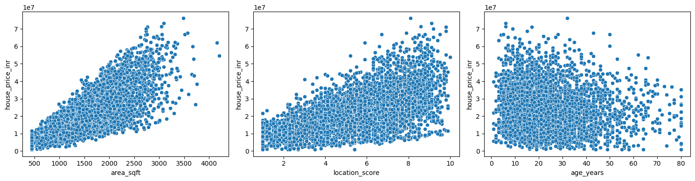
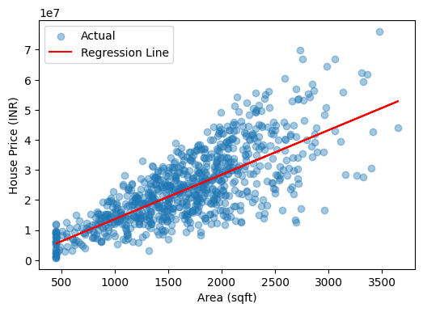
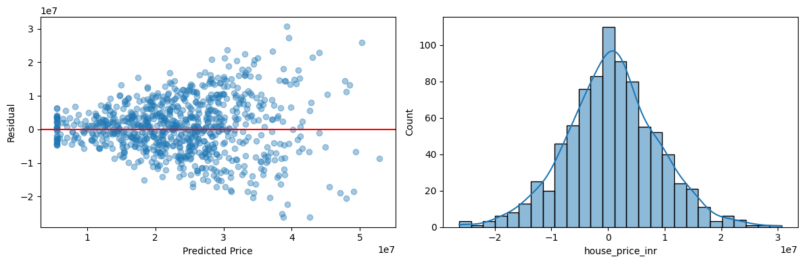
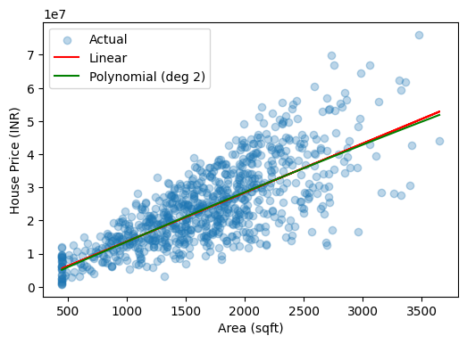
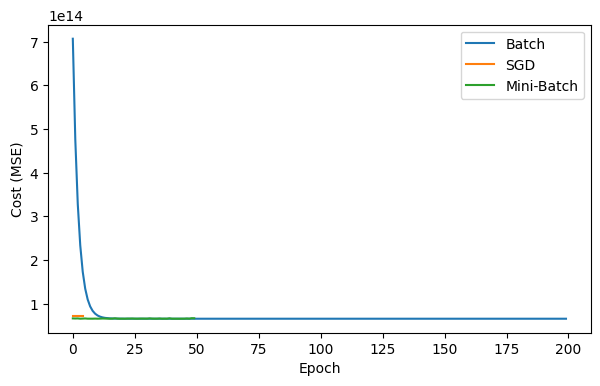

# Predictive Insight Engine

Supervised learning project to predict house prices from property features, comparing Simple, Multiple and Polynomial Regression, and implementing Gradient Descent (Batch, SGD, Mini-Batch) from scratch.

## Objective

Build and evaluate multiple regression models to estimate house prices for a real estate analytics firm, and explain why certain models perform better than others.

## Dataset

`realestate_houseprice_dataset_.csv` — 4,200 records, 10 features:

`area_sqft`, `bedrooms`, `bathrooms`, `location_score`, `age_years`, `distance_city_km`, `lot_size_sqft`, `has_garage`, `has_pool`, `renovation_years_ago` → **Target:** `house_price_inr`

## Tech Stack

Python · pandas · NumPy · scikit-learn · matplotlib · seaborn

## Project Structure

```
Predictive Insight Engine/
├── Predictive_Insight_Engine.ipynb   # Full analysis, Parts A–I
├── PR. 1.pdf                         # Part A theory (Q&A)
├── realestate_houseprice_dataset_.csv
├── visuals/                          # Exported charts
└── README.md
```

## Methodology

| Part | Coverage |
|---|---|
| A | Conceptual theory — supervised learning, regression, assumptions, bias-variance |
| B | Dataset understanding, EDA, train-test split |
| C | Simple Linear Regression (area vs price) |
| D | Evaluation metrics — MAE, MSE, RMSE, R², Adjusted R² |
| E | Multiple Linear Regression (all features) |
| F | Polynomial Regression (degree 2) |
| G | Gradient Descent — Batch, SGD, Mini-Batch (from scratch) |
| H | Bias-variance diagnostics across models |
| I | Final analysis and business interpretation |

## Results

| Model | MAE | RMSE | R² | Adjusted R² |
|---|---|---|---|---|
| Simple Linear | 6,294,594 | 8,184,697 | 0.563 | 0.562 |
| Multiple Linear | 2,604,991 | 3,548,650 | 0.918 | 0.917 |

**Gradient Descent comparison** (on normalized `area_sqft`):

| Method | Final Cost (MSE) | Time (s) |
|---|---|---|
| Batch | 6.57e13 | 0.006 |
| SGD | 7.22e13 | 0.016 |
| Mini-Batch | 6.67e13 | 0.026 |

**Best model:** Multiple Linear Regression — highest R²/Adjusted R² and the smallest train-test gap (0.007), showing it generalizes best. Simple Linear underfits on area alone; Polynomial Regression on a single feature adds little since the area–price relationship is close to linear.

## Visualizations



*Feature relationships with price — area shows the clearest linear trend.*



*Simple Linear Regression fit (area vs price).*



*Residual analysis — errors are centered around zero and roughly normal.*



*Linear vs Polynomial (degree 2) fit — nearly identical, area-price relation is close to linear.*



*Gradient Descent convergence — Batch, SGD and Mini-Batch all reach the same minimum.*

## Conclusion

Price is driven by more than size alone — location, bathrooms, and amenities like a pool move predicted price meaningfully. A production pricing tool for this firm should use Multiple Linear Regression with the full feature set rather than an area-only estimate.

## Author

Om Vaja —
